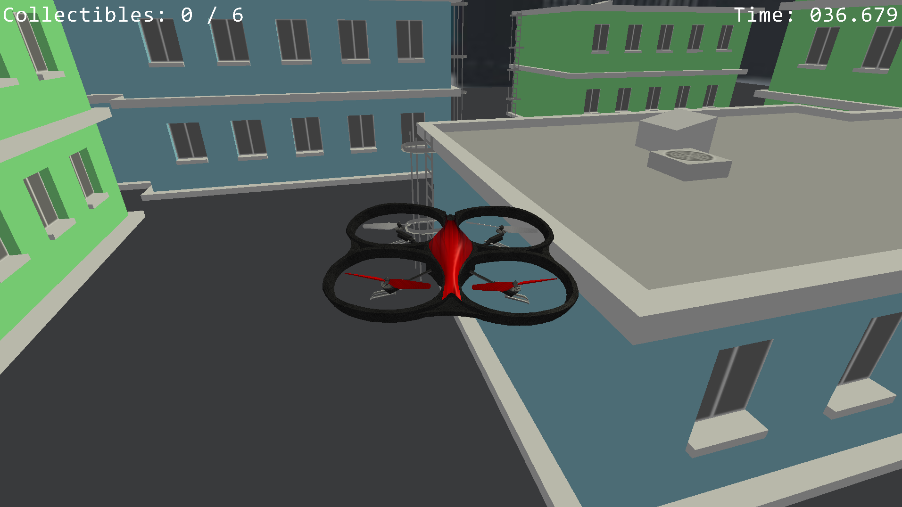
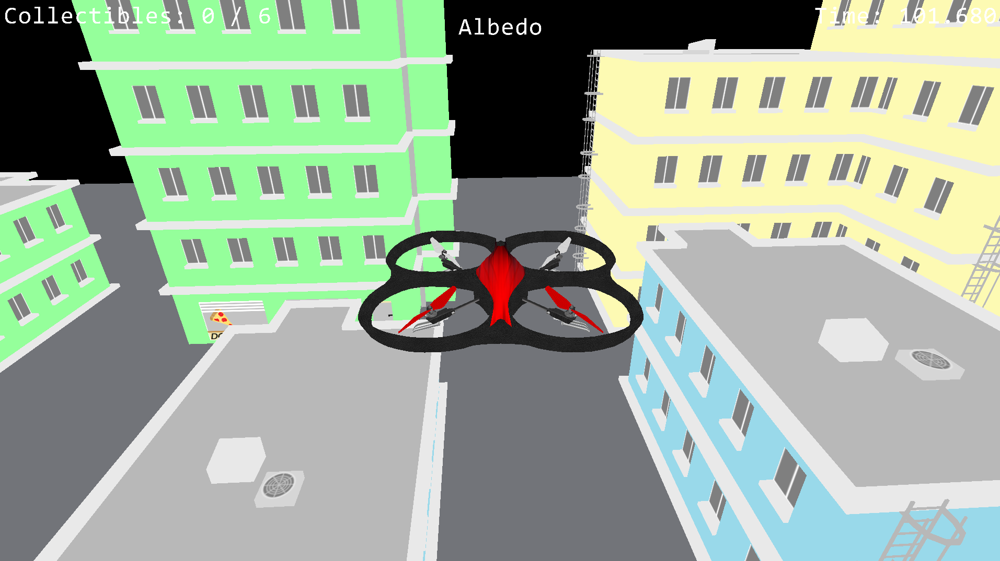
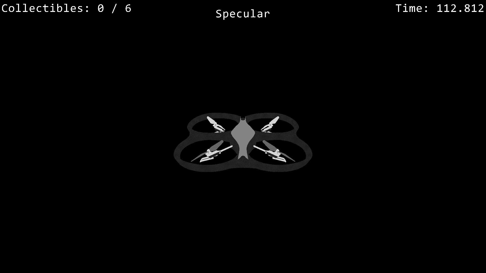
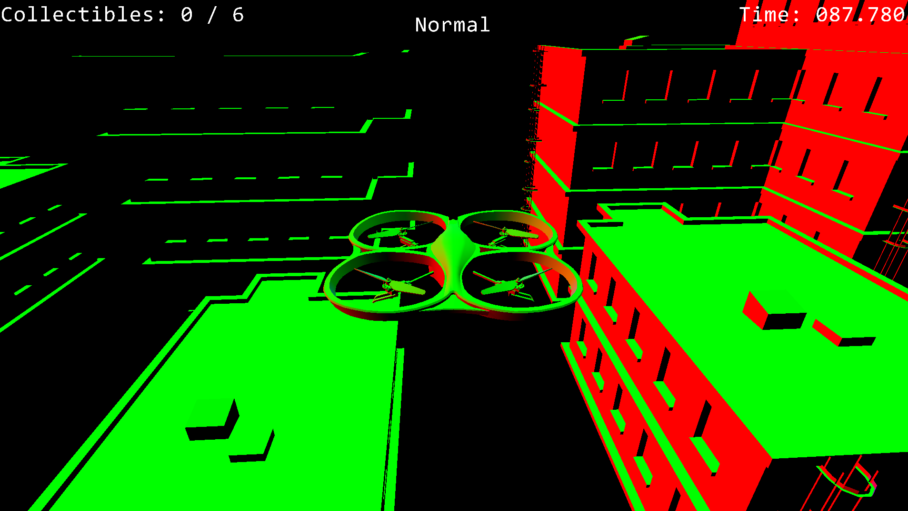
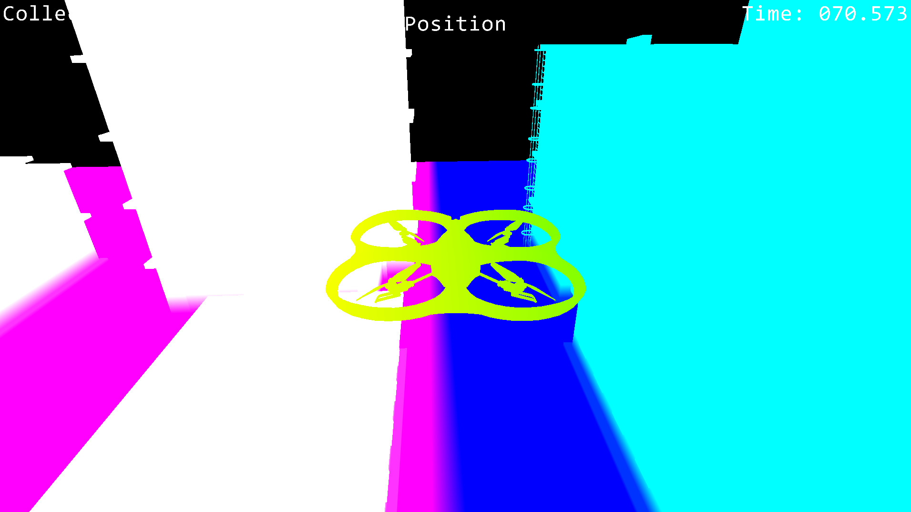
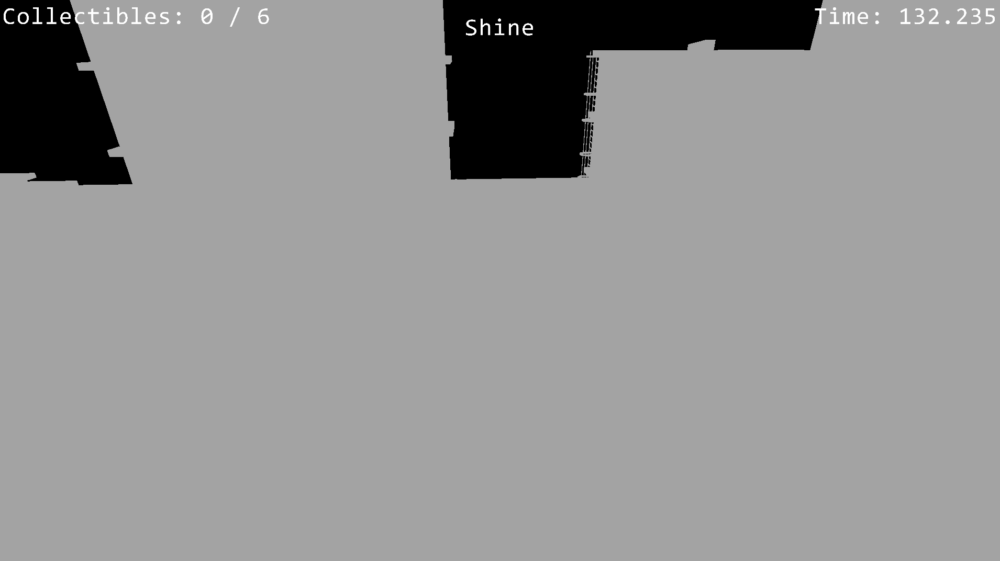
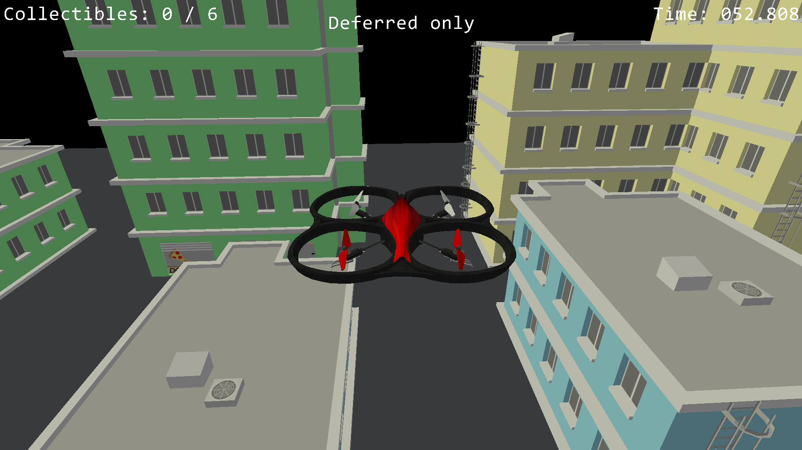
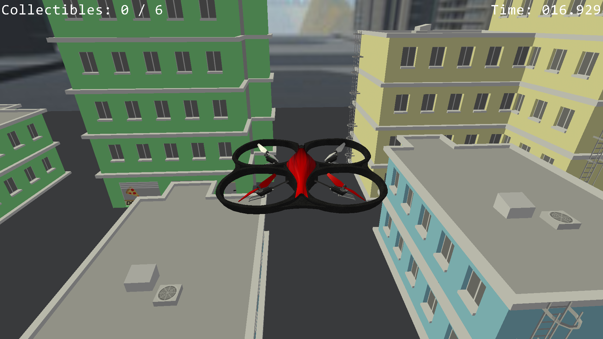

# Course Project: Drone Demo
This project is the result of the shader programming masters course "Shaderkonzepte" at the Hochschule Darmstadt, held by Benjamin Meyer.
The group consisted of Yannik Hupfer and Marvin Weisbrod.

The following readme will give an overview of the project. A more detailed report can be found [here](doc/project_report.pdf)

## Base Project
We were provided with an empty project that already has OpenGL, GLEW, and a basic game loop set up and ready to go. Shaders and game logic had to be written by us.

## Assignment
The assignment was to realize any small game we could think of to test and improve our shader-programming skills.
We decided to implement a small game where the user flies around with a drone in a highrise scenery collecting objects as fast as possible.

## Features

### Drone
The drone can be controlled with the keyboard. It has some basic acceleration logic and is animated.

### Collision
Due to time constraints we wanted to keep the collision detection as simple as possible, so we're working with axis-aligned bounding boxes attached to every building.

### Collectibles
The cake collectibles use AABBs as well and are animated to make identification easier.

### Text Rendering
We needed a way to present some information to the user, like score and time. For this we implemented a basic text renderer that uses a font map to display letters. It possesses basic features like custom text alignment and color, but is otherwise very limited.

### Night Mode
The user can switch to a night mode, where sunlight is heavily reduced, the done has a flashlight, and numerous pointlights appear in the scenery.

### Deferred Rendering
As an exercise for ourselves we decided to implement deferred rendering. 
During the first rendering step all objects are rendered into buffers with any information relevant to lighting, like position, normal, color, emissive, specular+shine. In the next rendering step, a separate shader takes this buffer and renders the final image with full lighting.

To better visualize what's going on we can output the different buffers directly:

### Others
We added a basic skybox to improve the visual fidelity.

## Models
[Skybox](https://gamebanana.com/mods/download/8355)

[Cake](https://www.models-resource.com/pc_computer/portal/model/15917/)

[Drone](https://assetstore.unity.com/packages/tools/physics/drone-controller-demo-134089)
